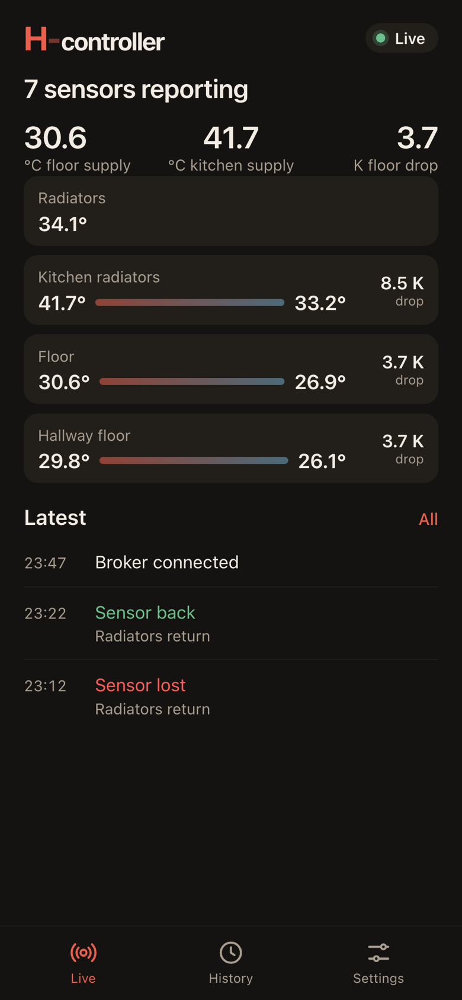
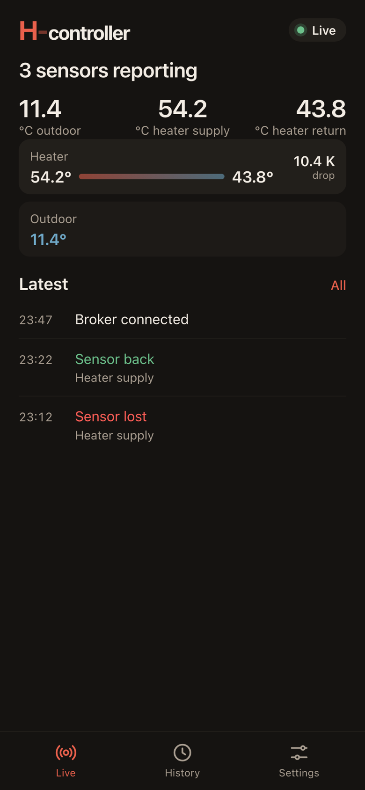
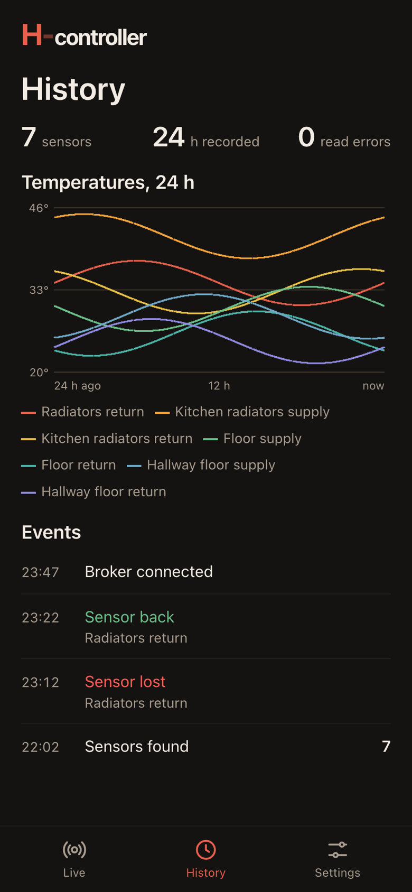
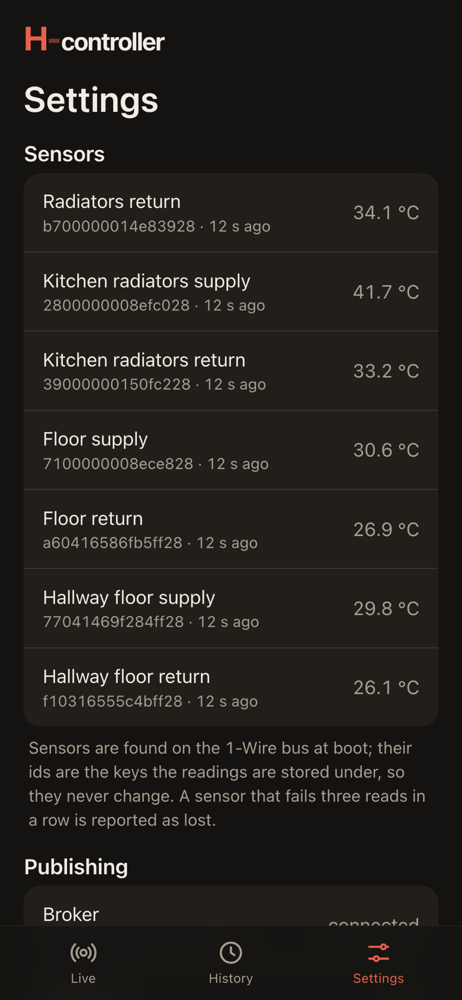
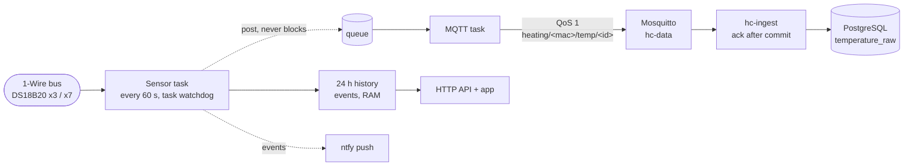

# heating-controller

**Two ESP32 boards that measure the house's heating circuits every minute and keep that record going whatever
happens around them.**

DS18B20 sensors on the supply and return pipes of the heater, the radiators and the underfloor loops, plus one
outdoors. Each board reads its 1-Wire bus once a minute and publishes every reading over MQTT to a PostgreSQL
database on a small home server, where the outdoor series goes back to February 2023. The rule behind every line of
firmware: **collecting readings is the product**, and the app, the notifications and the network must never weaken
it.

<p align="center">
  
  
  
  
</p>

<p align="center"><sub>The web app the boards serve, rendered with sample data (<code>tools/preview.py</code>).</sub></p>

## What it does

- **Reads every sensor once a minute**: 3 on board 1 (heater supply and return, outdoor), 7 on board 2 (radiators,
  kitchen radiators, floor and hallway floor loops).
- **Publishes each reading** over MQTT QoS 1 to Mosquitto on the home server; an ingest service writes it to
  PostgreSQL and acknowledges only after the commit, so a reading is stored at least once and duplicates collapse on
  the primary key.
- **Keeps readings through outages**: a reading taken before the clock is set or while the broker is unreachable
  waits in a queue and gets its timestamp when it is sent.
- **Notices sensors going away**: three failed reads in a row mark a sensor lost, and it is reported again when it
  comes back. Sensor ids never change, so a rescan keeps each sensor's history series.
- **App** for phone, tablet and desktop: one row per circuit pairing supply with return and showing the drop across
  it, three headline numbers per board, a 24 h chart of every sensor, the last 50 events, sensor and system health.
- **Push notifications** ([ntfy](https://ntfy.sh)): a lost or recovered sensor, a rescan finding a different number
  of sensors, a full MQTT outbox, every error line and unexpected resets.
- **Safe over-the-air updates**: a new image is verified after the first boot and rolled back if the sensor task or
  Wi-Fi does not come up.

## One binary, two boards

Both boards run the same image. At boot it reads its own MAC address and picks everything board-specific from a
table in [`firmware/main/config/devices.h`](firmware/main/config/devices.h): hostname, app headline, notification
title and the three headline numbers (a single sensor, or the drop across a supply/return pair). Sensor labels and
circuits mirror the `sensor` table in the database, so the app can name every sensor without a server.

| Board | Sensors | Headline numbers |
|---|---|---|
| Heating 1 | heater supply and return, outdoor | outdoor, heater supply, heater return |
| Heating 2 | radiators return, kitchen radiators, floor, hallway floor (supply and return each) | floor supply, kitchen supply, floor drop |

## Collecting comes first



- **The sensor task is the only code that touches the bus in a loop.** It never waits on the network: a reading is
  handed to the MQTT task through a queue, so an unreachable broker cannot stall sampling. (It once did: the esp-mqtt
  API lock is held across a connection attempt, and a board publishing directly from the sensor task was reset by
  its watchdog during a network outage. Firmware 2.0.3 moved publishing to its own task.)
- **Health means sampling.** The image is only confirmed when the sensor task is alive and Wi-Fi is up; a stalled
  task rolls a fresh image back, and the task watchdog reboots a hung one. An empty bus counts as alive and is shown
  in the app ("Looking for sensors on the bus"), so a broken harness does not make the board bounce between builds.
- **The app serves the last sample.** Only `/sensor`, kept from the legacy firmware for a clock display that shows
  the outdoor temperature, reads the bus inline.
- **The MQTT topics and payload are a contract** with the ingest service and three years of history; they have not
  changed since the legacy firmware.

## Built on home-idf

Everything that is not sensors and publishing comes from [home-idf](https://github.com/tomekceszke/home-idf), the
component shared with the water, floor-heating and gate controllers: Wi-Fi that joins the strongest access point,
UDP logging, NTP, HTTPS OTA with a pinned certificate, image verification with rollback, ntfy notifications, the
MQTT client, web sign-in (PBKDF2 password, sessions in NVS, CSRF and `Origin`/`Host` checks, login back-off) and
the HTTP server with its guards.

The app is built on the same shell as the other controllers: wordmark and status pill, headline, three numbers, a
main view, the latest events, and the Live / History / Settings tabs. It has no dock with a slide control, because
there is nothing to switch: the boards only measure.

## Firmware 2.x, installed over the air

The legacy firmware ran on the stock `two_ota` partition table with 1 MB slots, no coredump partition and a
bootloader older than ESP-IDF 5.1. Firmware 2.x uses the layout of the other controllers (ota_0 2 MB, ota_1
1.875 MB, coredump) and the ESP-IDF 5.4.2 bootloader with native rollback. `migrator/` is home-idf's one-shot
`hi_migrator` image: it fits the legacy slot, checks everything it can, writes the new bootloader and table, then
downloads the real firmware. Both boards poll the same file name on the OTA server, so they were migrated strictly
one after the other.

The migration itself worked on both boards, and the first board still found a bug: 2.0.0 slept a whole sampling
period without feeding a watchdog whose timeout Kconfig had silently capped, and rebooted every 8 s, too fast to
take an update over the air. It was recovered over USB with 2.0.1. The procedure, the checks and the
minute-by-minute log are in [docs/IDF5_MIGRATION.md](docs/IDF5_MIGRATION.md).

## Data

Readings land in PostgreSQL on `hc-data`, a Proxmox container shared with water-controller: table
`temperature_raw(ts, sensor_id, value, device)` with the primary key `(sensor_id, ts)`, a `sensor` table with
labels and circuits, and views ported from the former BigQuery setup (last hour, last six hours, outdoor,
supply/return power). The history from Google Cloud (1.48 million rows, outdoor since February 2023) was imported
before the cloud project was shut down. Backups: a nightly `pg_dump`.

MQTT topics:

| Topic | Payload |
|---|---|
| `heating/<mac>/temp/<sensor_id>` | `{"ts":<unix>,"value":<°C>}`, one per sensor per minute, QoS 1 |
| `heating/<mac>/status` | `online` / `offline`, retained, last will |
| `heating/<mac>/state` | the full status document, retained, refreshed every minute (2.1.0) |

Details: [server/README.md](server/README.md).

## Hardware

| Item | Value |
|---|---|
| Module | ESP32, 4 MB flash (DIO, 40 MHz), two boards |
| Sensors | DS18B20 on 1-Wire, GPIO4, RMT driver (vendored `esp32-owb` and `esp32-ds18b20`) |
| Sampling | every 60 s, one row per sensor per minute |

The RMT driver is kept on purpose: a bit-banged 1-Wire driver found only 1 of the 7 sensors on board 2's long bus.
USB is the recovery path: hold **IO0**, press and release **EN**, release **IO0**, then flash bootloader, table and
app over serial.

## Repository

```
firmware/     ESP-IDF 5.4.2 firmware 2.x (C): sensor task, MQTT publishing, events, 24 h history,
              HTTP API, board table, app (web/)
migrator/     one-shot image that moved the legacy boards to the 2.x bootloader and partition table
server/       hc-data backend: Mosquitto, PostgreSQL schema and views, MQTT ingest, backups, history import
tools/        release build, app preview and README screenshots with mocked API data
docs/         migration procedure and production log, README screenshots (img/)
```

## Build

```sh
cp firmware/main/config/credentials-example.h firmware/main/config/credentials.h   # Wi-Fi, password hash, MQTT, ntfy
# firmware/certs/ota_server_cert_15.pem: the certificate of your OTA server
firmware/build.sh                                  # ESP-IDF 5.4.2
firmware/build.sh -p /dev/cu.usbserial-0001 flash  # over USB, in download mode
tools/build_release.sh                             # firmware + migrator into releases/ with sha256
tools/preview.py --board 2                         # the app with mocked data, no board needed
server/deploy.sh                                   # backend onto hc-data (needs server/secrets.env)
```

Passwords are hashed with `home-idf/tools/hash_password.py`, other secrets obfuscated with
`home-idf/tools/obfuscate.py`. Nothing in `credentials.h`, `certs/` or `secrets.env` is committed. Setup,
conventions and device details: [CLAUDE.md](CLAUDE.md).

## API

Sign-in and the common routes (`/`, `/api/session`, `/api/login`, `/api/reboot`, `/api/ota`, `/admin/hw-status`, …)
come from home-idf. Controller routes:

| Method | Path | Guard | |
|---|---|---|---|
| GET | `/api/status` | session | sensors with label, circuit, reading and age, the three headline numbers, MQTT, system |
| GET | `/api/events` | session | the last 50 events |
| GET | `/api/history` | session | 24 h of one-minute samples per sensor |
| GET | `/admin/status` | `Authorization` header | same as `/api/status`, for scripts |
| GET | `/sensor?sensor_id=<id>` | none | `{"value":21.5}`, unchanged from the legacy firmware |

## History

- **Until 2026**: the first firmware: DS18B20 readings sent to Google Cloud (Cloud Functions and BigQuery),
  with the outdoor series kept since February 2023.
- **2026-09-11**: the cloud replaced by local MQTT and PostgreSQL; BigQuery history imported.
- **2026-09-17 to 2026-09-21**: firmware 2.x on home-idf: one binary for both boards, the app, events and 24 h
  history, and the over-the-air migration to the ESP-IDF 5.4.2 bootloader and the new partition table. The Google
  Cloud project was shut down afterwards.

## License

MIT
